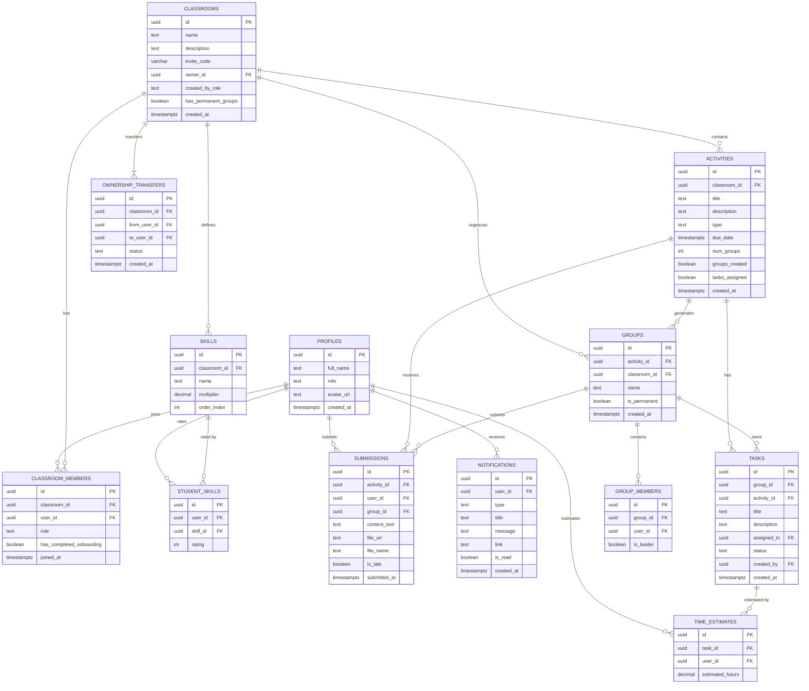

# Trippy Tropa v2 — Product Requirements Document

> **Version**: 1.0  
> **Last Updated**: June 14, 2026  
> **Status**: Draft — Awaiting Approval

---

## 1. Product Overview

### 1.1 Vision
Trippy Tropa is a smart classroom grouping platform that empowers teachers and student officers to create balanced student groups using skill-based algorithms and optimally assign tasks within those groups. It replaces the manual, often unfair, process of forming project teams with a data-driven, transparent system.

### 1.2 Problem Statement
In academic settings:
- **Group formation is manual and biased** — teachers guess or students self-select, leading to unbalanced teams
- **Task distribution within groups is uneven** — one person does most of the work
- **There's no visibility** into who's doing what inside project teams

### 1.3 Solution
Trippy Tropa solves this with:
1. **Skill-based auto-grouping** (Greedy LPT algorithm) — balanced teams based on quantified student skills
2. **Optimal task assignment** (Hungarian algorithm) — tasks assigned to minimize total estimated effort
3. **Transparent task tracking** (Kanban board) — everyone sees who's doing what

### 1.4 Tech Stack

| Layer | Technology |
|---|---|
| Frontend | Next.js 15 (App Router), TypeScript, React 19 |
| Styling | Vanilla CSS (dark mode, glassmorphism) |
| Backend | Next.js Server Actions + API Routes |
| Database | PostgreSQL (via Supabase) |
| Auth | Supabase Auth (email/password) |
| File Storage | Supabase Storage |
| QR Codes | `qrcode.react` (client-side) |
| Drag & Drop | `@dnd-kit/core` + `@dnd-kit/sortable` |
| Deployment | Vercel (frontend) + Supabase Cloud (backend) |

### 1.5 Design Language

| Token | Value |
|---|---|
| Background Primary | `#0a0a1a` (deep navy) |
| Background Secondary | `#12122a` (dark indigo) |
| Card Background | `rgba(255, 255, 255, 0.05)` with `backdrop-filter: blur(20px)` |
| Accent Primary | `#6c5ce7` (electric purple) |
| Accent Secondary | `#00cec9` (teal cyan) |
| Accent Gradient | `linear-gradient(135deg, #6c5ce7, #00cec9)` |
| Danger | `#ff6b6b` |
| Success | `#00b894` |
| Warning | `#fdcb6e` |
| Text Primary | `#f0f0f0` |
| Text Secondary | `rgba(255, 255, 255, 0.6)` |
| Font Family | `Inter` (Google Fonts) |
| Border Radius | `12px` (cards), `8px` (inputs/buttons) |
| Card Border | `1px solid rgba(255, 255, 255, 0.08)` |
| Card Hover Glow | `box-shadow: 0 0 30px rgba(108, 92, 231, 0.15)` |

**Navigation**: Collapsible sidebar (classroom list) + top header (logo, notifications bell, user menu). Discord/Linear-inspired layout.

---

## 2. Roles & Permissions

### 2.1 Global Roles (set at sign-up)

| Role | Description |
|---|---|
| **Student** | Joins classrooms, completes assessments, submits work |
| **Teacher** | Creates/manages classrooms, configures skills, creates activities |

### 2.2 Per-Classroom Roles (contextual within a classroom)

| Role | Granted By | Permissions |
|---|---|---|
| **Student** | Default on join | View activities, submit work, edit own time estimates, update own task status |
| **Student Officer (Beadle)** | Teacher promotes | Everything a student can do + create activities, manage groups, configure skills, promote other students |
| **Teacher** | Sign-up role or ownership transfer | Everything an officer can do + delete classroom, transfer ownership |
| **Group Leader** | Auto-assigned (highest skill score) | Everything a student can do + delete tasks in their group, submit on behalf of group, trigger auto-assign |

### 2.3 Ownership Model
- Every classroom has exactly **one owner** (`owner_id` in `classrooms` table)
- The owner is either the teacher who created it or the student officer who created it
- Ownership can be **transferred** from a student officer to a teacher via an explicit accept flow

---

## 3. Complete Database Schema

> [!NOTE]
> All tables use UUID primary keys. All timestamps are `TIMESTAMPTZ`. Supabase Row Level Security (RLS) is enabled on every table.

### 3.1 Entity Relationship Diagram



### 3.2 Row Level Security Policies

| Table | Policy | Rule |
|---|---|---|
| `profiles` | Read own | `auth.uid() = id` |
| `profiles` | Read classroom peers | User shares a classroom with the profile |
| `classrooms` | Read | User is a member of the classroom |
| `classrooms` | Insert | Any authenticated user |
| `classrooms` | Update/Delete | `auth.uid() = owner_id` |
| `classroom_members` | Read | User is a member of the same classroom |
| `classroom_members` | Insert | Owner/officer of the classroom, or self-join via invite |
| `skills` | Read | User is a member of the classroom |
| `skills` | Write | Owner or officer of the classroom |
| `student_skills` | Read own | `auth.uid() = user_id` |
| `student_skills` | Read as teacher | User is teacher/officer in the classroom |
| `student_skills` | Write own | `auth.uid() = user_id` |
| `activities` | Read | User is a member of the classroom |
| `activities` | Write | Owner or officer of the classroom |
| `groups` | Read | User is a member of the classroom |
| `group_members` | Read | User is a member of the classroom |
| `tasks` | Read | User is a member of the group |
| `tasks` | Insert | User is a member of the group |
| `tasks` | Delete | User is the group leader |
| `tasks` | Update (status) | User is the assigned member (`assigned_to = auth.uid()`) |
| `time_estimates` | Read | User is a member of the group |
| `time_estimates` | Write own | `auth.uid() = user_id` |
| `submissions` | Read | User is a member of the classroom |
| `submissions` | Write | Submitter is the user (individual) or group leader (group) |
| `notifications` | Read/Update | `auth.uid() = user_id` |
| `ownership_transfers` | Read | User is `from_user_id` or `to_user_id` |

---

## 4. Build Phases

---

## Phase 1: Foundation

> **Goal**: Project scaffolding, database setup, authentication, and the UI design system. After this phase, users can sign up, log in, and see an empty dashboard.

### 4.1.1 User Stories

| ID | Story | Acceptance Criteria |
|---|---|---|
| F-1 | As a new user, I can sign up with email/password and select my role (Student or Teacher) | User sees a sign-up form with email, password, full name, and a role toggle. On submit, account is created in Supabase Auth + `profiles` table. User is redirected to dashboard. |
| F-2 | As a returning user, I can log in with email/password | User sees a login form. On valid credentials, redirected to dashboard. On invalid, error message shown. |
| F-3 | As a logged-in user, I see a role-appropriate empty dashboard | Teachers see "Create Classroom" CTA. Students see "Join Classroom" input + empty classroom list. |
| F-4 | As an unauthenticated user, I am redirected to login when visiting protected routes | Middleware intercepts requests to `/dashboard/*`, `/classroom/*` and redirects to `/login`. |

### 4.1.2 Technical Requirements

#### Project Setup
- Initialize Next.js 15 with `npx create-next-app@latest ./` (TypeScript, App Router, ESLint, no Tailwind)
- Install: `@supabase/supabase-js`, `@supabase/ssr`
- Configure `.env.local` with `NEXT_PUBLIC_SUPABASE_URL` and `NEXT_PUBLIC_SUPABASE_ANON_KEY`
- Create Supabase client utilities for both server and client components

#### Database
- Create migration for `profiles` table
- Set up trigger: on `auth.users` insert → auto-create `profiles` row
- Enable RLS on `profiles`

#### Auth
- Supabase Auth with email/password provider
- `middleware.ts` — protect all app routes, refresh session cookies

#### UI Design System
- `globals.css` with all design tokens (colors, typography, spacing, animations)
- Import Inter font from Google Fonts
- Base component stubs: `Button`, `Card`, `Input`, `Modal`, `Badge`

### 4.1.3 Pages

#### [NEW] `app/(auth)/layout.tsx`
Centered layout. Dark gradient background (`#0a0a1a` → `#12122a`). Single glassmorphism card in the center. Trippy Tropa logo/text at top.

#### [NEW] `app/(auth)/signup/page.tsx`
- Fields: Full Name, Email, Password, Confirm Password
- Role selector: two clickable cards — "🎓 I'm a Student" / "👨‍🏫 I'm a Teacher" — with active state highlight (accent gradient border)
- Submit button with loading state
- Link: "Already have an account? Log in"
- Validation: all fields required, password min 6 chars, passwords must match

#### [NEW] `app/(auth)/login/page.tsx`
- Fields: Email, Password
- Submit button with loading state
- Link: "Don't have an account? Sign up"
- Error toast on invalid credentials

#### [NEW] `app/(app)/layout.tsx`
- **Sidebar** (left, 260px, collapsible to 72px):
  - Trippy Tropa logo at top
  - "Dashboard" nav link
  - "My Classrooms" section header → list of classroom names (populated in later phases, empty for now)
  - User avatar + name at bottom with logout option
- **Top header** (64px):
  - Page title (dynamic)
  - Right side: notification bell (placeholder), user menu
- **Main content area**: scrollable, padded

#### [NEW] `app/(app)/dashboard/page.tsx`
- **Teacher view**:
  - Welcome message with user's name
  - "Create Your First Classroom" CTA card (large, centered, accent gradient border, pulsing glow animation)
  - Empty state: "No classrooms yet" with illustration
- **Student view**:
  - Welcome message
  - "Join a Classroom" section: text input for 6-char code + "Join" button
  - "My Classrooms" section: empty state
  - "Upcoming" section: empty state

### 4.1.4 Verification
```bash
npm run build    # No TypeScript errors
npm run dev      # App loads at localhost:3000
```
- Manual: Sign up as teacher → see teacher dashboard. Sign up as student → see student dashboard. Log out → redirected to login. Try accessing `/dashboard` without auth → redirected to login.

---

## Phase 2: Classroom Management

> **Goal**: Teachers and student officers can create classrooms, generate invite codes/QR codes, and students can join. Classroom detail page shows student roster and basic info.

### 4.2.1 User Stories

| ID | Story | Acceptance Criteria |
|---|---|---|
| C-1 | As a teacher, I can create a new classroom with a name and description | Form with name + description. On submit, classroom created with auto-generated 6-char invite code. Redirected to success page showing QR code + invite link. |
| C-2 | As a teacher, I see a QR code and invite link after creating a classroom | QR code rendered client-side (encodes `{baseUrl}/join/{code}`). Invite link shown with "Copy" button. Code displayed large for manual entry. |
| C-3 | As a student, I can join a classroom by entering a 6-char code on my dashboard | Input accepts code, validates it exists, adds student as member, redirects to classroom page. Error if code invalid or already joined. |
| C-4 | As a student, I can join a classroom via an invite link (`/join/XK7M2P`) | If logged in → join directly (or redirect to onboarding in Phase 3). If not logged in → redirect to signup with return URL → after signup, rejoin flow. |
| C-5 | As a teacher, I can see all students enrolled in my classroom | Classroom detail page shows student roster as a list with names, join dates, and role badges. |
| C-6 | As a teacher, I can view the invite QR code/link anytime from the classroom page | "Invite" button opens a modal with QR code + link + code. |
| C-7 | As a student officer, I can create a classroom (same flow as teacher) | Student officers have a "Create Classroom" button. The `created_by_role` field is set to `'student'`. |
| C-8 | As a teacher, I can promote a student to Student Officer | In the student roster, a "⋮" menu on each student row has a "Promote to Officer" option. Confirmation dialog before promoting. |
| C-9 | As any user, I see my classrooms listed in the sidebar and on the dashboard | Sidebar shows classroom names. Dashboard shows classroom cards with name, description, and student count. |

### 4.2.2 Technical Requirements

#### Database
- Create migrations for: `classrooms`, `classroom_members` tables
- Invite code generator: 6-char uppercase alphanumeric, collision-checked
- RLS policies for classrooms and classroom_members

#### Server Actions
- `createClassroom(name, description)` → generates invite code, creates classroom + adds creator as member (role = their global role)
- `joinClassroom(code)` → validates code, creates classroom_member row
- `getClassrooms()` → returns classrooms for current user with member counts
- `getClassroomDetail(id)` → returns classroom info + member list
- `promoteMember(classroomId, userId)` → updates member role to `'student_officer'`

### 4.2.3 Pages

#### [NEW] `app/(app)/classroom/create/page.tsx`
- Glassmorphism form card
- Fields: Classroom Name (required), Description (textarea, optional)
- Submit button → loading state → redirects to success view
- Success view (same page, state change):
  - ✅ "Classroom Created!" header
  - Large QR code (centered, white background for scanability, rounded corners)
  - Invite code displayed in large monospace font: `XK7M2P`
  - Full invite link with copy-to-clipboard button
  - "Go to Classroom" button

#### [NEW] `app/(app)/classroom/[id]/page.tsx`
**Teacher / Officer view:**
- **Header section**: Classroom name (large), description, student count badge
- **Tab bar** or **section layout**:
  - **Students tab**: roster list — avatar placeholder (initials), name, role badge (`Student` / `Officer` / `Teacher`), joined date. "⋮" menu on each row for promote/remove actions.
  - **Activities tab**: empty state for now (built in Phase 4)
- **Action buttons** (top right):
  - "Invite Students" → opens QR/link modal
  - "Settings" → goes to settings page (Phase 4+)

**Student view:**
- Header with classroom name + description
- Activities list (empty for now)

#### [NEW] `components/classroom/InviteModal.tsx`
- Modal with backdrop blur
- QR code (white bg, 200×200px)
- Invite code in large monospace
- Copyable link with "Copied!" feedback animation
- "Download QR" button (saves as PNG)

#### [UPDATE] `app/(app)/dashboard/page.tsx`
- **Teacher**: classroom cards grid (name, description snippet, student count, created date). "Create Classroom" button.
- **Student**: "Join Classroom" input/button. Classroom cards grid for joined classrooms.

#### [UPDATE] `app/(app)/layout.tsx`
- Sidebar now dynamically lists classrooms (fetched from DB)
- Each classroom in sidebar is clickable → navigates to `/classroom/[id]`

### 4.2.4 Verification
- Create classroom → verify invite code generated → copy link → open in incognito → sign up as student → join → verify student appears in roster
- Join via dashboard code input → verify it works
- Promote student to officer → verify badge updates
- Test invalid code → verify error message

---

## Phase 3: Skill Assessment & Onboarding

> **Goal**: Teachers configure custom skill assessment forms for their classrooms. Students complete the assessment when joining a classroom for the first time. Skill scores are stored and ready for the grouping algorithm.

### 4.3.1 User Stories

| ID | Story | Acceptance Criteria |
|---|---|---|
| S-1 | As a teacher, I can define custom skills for my classroom (e.g., "Python", "UI Design") | In classroom settings, a "Skill Assessment" section lets the teacher add skill names. Each skill has a name, a multiplier (default 1.0), and a drag handle for reordering. |
| S-2 | As a teacher, I can set a multiplier for each skill (e.g., Python ×2.0 for a CS class) | Each skill row has a numeric input for multiplier. Multiplier affects the weighted score: `weighted_score = rating × multiplier`. |
| S-3 | As a teacher, I can add, edit, reorder, and delete skills | "Add Skill" button appends a new row. Inline editing for name/multiplier. Delete button with confirmation. Drag to reorder. |
| S-4 | As a student joining a classroom for the first time, I see the skill assessment form | After joining (via code or invite link), if `has_completed_onboarding = false` AND the classroom has skills defined, redirect to `/onboarding/[classroomId]`. |
| S-5 | As a student, I can rate myself 1-5 on each skill | Each skill shows the name and a 1-5 rating input (interactive star rating or slider). All skills must be rated before submission. |
| S-6 | As a student, I am redirected to the classroom after completing onboarding | On submit, ratings are saved to `student_skills`, `has_completed_onboarding` is set to `true`, and the student is redirected to the classroom detail page. |
| S-7 | As a teacher, I can view a student's skill ratings | In the student roster, clicking a student shows their skill ratings in a popover or side panel. |

### 4.3.2 Technical Requirements

#### Database
- Create migrations for: `skills`, `student_skills` tables
- RLS policies

#### Computed Values (used in Phase 4)
```
For each student in a classroom:
  overall_skill_score = Σ (student_rating[skill_i] × skill_multiplier[skill_i])
```

Example:
| Skill | Multiplier | Student Rating | Weighted |
|---|---|---|---|
| Python | 2.0 | 4 | 8.0 |
| UI Design | 1.0 | 3 | 3.0 |
| Communication | 1.5 | 5 | 7.5 |
| **Total** | | | **18.5** |

#### Server Actions
- `getSkills(classroomId)` → returns ordered list of skills
- `upsertSkill(classroomId, { name, multiplier, order_index })` → add or update
- `deleteSkill(skillId)` → remove skill (cascades to student_skills)
- `reorderSkills(classroomId, orderedIds[])` → update order_index
- `submitSkillRatings(classroomId, ratings[])` → save student_skills + set onboarding complete
- `getStudentSkills(classroomId, userId)` → returns ratings for a student

### 4.3.3 Pages

#### [NEW] `app/onboarding/[classroomId]/page.tsx`
- Full-page layout (no sidebar — focused experience)
- Header: "Welcome to {Classroom Name}" + "Let's assess your skills"
- Description text: "Rate yourself honestly from 1 to 5 on each skill below. Your ratings help us form balanced project teams."
- Skill list: each skill shown as a card with:
  - Skill name (large)
  - Multiplier badge (e.g., "×2.0" in accent color) — visible so students know what's weighted heavily
  - Interactive 1-5 rating (5 clickable circles/stars that fill with accent gradient)
  - Label anchors: 1 = "Beginner", 3 = "Intermediate", 5 = "Expert"
- "Submit Assessment" button (disabled until all skills rated)
- Progress indicator: "3 of 5 skills rated"

#### [NEW] `app/(app)/classroom/[id]/settings/page.tsx`
- **Skill Assessment Configuration** section:
  - List of current skills with inline edit (name input, multiplier input)
  - Drag handles for reordering
  - Delete button (with "Are you sure?" confirmation)
  - "Add Skill" button at bottom → appends empty row
  - Auto-save on blur or explicit "Save" button
- **Classroom Info** section (name, description editing)
- **Danger Zone**: delete classroom (owner only)

#### [UPDATE] `app/join/[code]/page.tsx`
- After joining, check if classroom has skills defined AND student hasn't completed onboarding
- If yes → redirect to `/onboarding/[classroomId]`
- If no skills defined → redirect to `/classroom/[id]` directly

#### [UPDATE] `app/(app)/classroom/[id]/page.tsx`
- Student roster now shows a skill score badge next to each student (calculated overall score)
- Click on a student → popover/slide-out with their skill breakdown (radar chart or bar chart)
- "Settings" button for teachers → navigates to settings page

### 4.3.4 Verification
- Teacher creates 4 skills with different multipliers → Student joins → sees onboarding → rates all skills → redirected to classroom
- Verify overall_skill_score is calculated correctly
- Teacher views student's ratings → verify they match what was submitted
- Student who already completed onboarding → joining again does NOT show onboarding
- Classroom with no skills → student skips onboarding

---

## Phase 4: Activities & Smart Grouping

> **Goal**: Teachers/officers create activities (individual or group). For group activities, the Greedy LPT algorithm auto-generates balanced groups. Groups can be previewed, manually adjusted, and confirmed. Ownership transfer is implemented.

### 4.4.1 User Stories

| ID | Story | Acceptance Criteria |
|---|---|---|
| A-1 | As a teacher, I can create an individual activity | Form with title, description, due date. Type set to "individual". Activity appears in classroom's activity list. |
| A-2 | As a teacher, I can create a group activity and specify the number of groups | Same form, but type "group" adds a "Number of Groups" numeric input. Validation: groups ≤ number of students. |
| A-3 | As a teacher, I can run the auto-grouping algorithm for a group activity | On the activity detail page, a "Generate Groups" button runs the Greedy LPT algorithm and shows a **draft preview**. |
| A-4 | As a teacher, I can preview the generated groups before confirming | Draft view shows groups as columns/cards. Each group shows: group name, member names, member skill scores, and group total score. Visual balance indicator (bar chart of group totals). |
| A-5 | As a teacher, I can manually move students between groups in the draft | Drag-and-drop students between group columns. Group totals update live. |
| A-6 | As a teacher, I can confirm the group assignments | "Confirm Groups" button finalizes the draft. Groups are saved to the database. Students are notified (Phase 6). |
| A-7 | As a student, I can see the activities listed in my classroom | Activity cards show title, type badge (Individual / Group), due date, and status (upcoming / overdue). |
| A-8 | As a student, I can see which group I belong to for a group activity | Activity detail page shows "Your Group: Group 3" with member list. |
| A-9 | As a student officer, I can transfer classroom ownership to a teacher | In classroom settings, "Transfer Ownership" button → select a teacher from members → send request. Teacher sees a pending transfer notification and can accept/reject. |
| A-10 | As a teacher, I can accept an ownership transfer | Accept button on the transfer request. Ownership updates. The original officer retains officer role. |

### 4.4.2 Algorithm Specification: Greedy LPT

```
GREEDY_LPT_GROUPING(students[], num_groups):
  
  Input:
    - students[]: array of { id, name, overall_skill_score }
    - num_groups: integer (number of groups to create)
  
  Process:
    1. Sort students by overall_skill_score DESCENDING
    2. Initialize groups[1..num_groups] as empty arrays, each with total_score = 0
    3. For each student in sorted order:
       a. Find the group with the MINIMUM total_score
          (tie-break: group with fewer members, then lower index)
       b. Add student to that group
       c. Update group.total_score += student.overall_skill_score
    4. For each group:
       a. Assign leader = member with highest individual overall_skill_score
  
  Output:
    - groups[]: array of { name, members[], total_score, leader_id }
  
  Example (6 students, 2 groups):
    Scores: [25, 20, 18, 15, 12, 10]
    
    Step 1: Student(25) → Group 1 [total: 25]
    Step 2: Student(20) → Group 2 [total: 20]
    Step 3: Student(18) → Group 2 [total: 38]
    Step 4: Student(15) → Group 1 [total: 40]
    Step 5: Student(12) → Group 1 [total: 52]
    Step 6: Student(10) → Group 2 [total: 48]
    
    Result:
      Group 1: [25, 15, 12] → total 52, leader: Student(25)
      Group 2: [20, 18, 10] → total 48, leader: Student(20)
    
    Balance: 52 vs 48 (difference of 4 — well balanced!)
```

### 4.4.3 Technical Requirements

#### Database
- Create migrations for: `activities`, `groups`, `group_members`, `ownership_transfers` tables
- RLS policies

#### Server Actions
- `createActivity(classroomId, { title, description, type, due_date, num_groups })`
- `getActivities(classroomId)` → list of activities with status
- `getActivityDetail(activityId)` → activity info + groups (if group type)
- `generateGroups(activityId)` → runs Greedy LPT, returns draft (not saved yet)
- `saveGroupsDraft(activityId, groups[])` → saves groups + members to DB, sets `groups_created = true`
- `updateGroupMembership(groupId, addUserIds[], removeUserIds[])` → manual adjustment
- `requestOwnershipTransfer(classroomId, toUserId)` → creates pending transfer
- `respondToTransfer(transferId, 'accepted' | 'rejected')` → updates transfer + classroom owner

### 4.4.4 Pages

#### [NEW] `app/(app)/classroom/[id]/activity/create/page.tsx`
- Glassmorphism form card
- Fields:
  - Title (text input, required)
  - Description (rich textarea, required)
  - Type toggle: "Individual" / "Group" (two cards, selectable)
  - Due Date (date-time picker)
  - If Group: "Number of Groups" (numeric input with stepper, min 2, max = student count)
- Submit button → create activity → redirect to activity detail

#### [NEW] `app/(app)/classroom/[id]/activity/[activityId]/page.tsx`

**Individual Activity — Teacher View:**
- Header: title, description, due date with countdown
- Submission table: student name, status (Submitted ✅ / Missing ❌ / Late ⚠️), submitted date
- (Submission functionality built in Phase 6)

**Individual Activity — Student View:**
- Header: title, description, due date
- Submission area (built in Phase 6)

**Group Activity — Teacher/Officer View (groups NOT yet created):**
- Header: title, description, due date
- Info card: "{X} students enrolled, creating {Y} groups ({Z} students per group)"
- "Generate Balanced Groups" button (large CTA, accent gradient)
- On click → loading animation → shows draft view:

**Group Draft Preview:**
- Balance overview: horizontal bar chart showing each group's total score
- Group columns (side by side, scrollable):
  - Group name (editable)
  - Total score badge
  - Leader indicator (crown icon)
  - Member cards: name, skill score, drag handle
  - Students can be dragged between columns
- Bottom bar: "Confirm Groups" button + "Regenerate" button

**Group Activity — Teacher/Officer View (groups confirmed):**
- Group cards in a grid:
  - Group name, member count, leader name
  - Total skill score badge
  - Submission status (Submitted / Pending)
  - Click → navigates to group detail page

**Group Activity — Student View:**
- "Your Group" card: group name, members list, leader badge
- Task/Kanban section (built in Phase 5)

#### [UPDATE] `app/(app)/classroom/[id]/page.tsx`
- Activities tab now lists activities as cards
- Each card: title, type badge, due date, status indicator
- "Create Activity" button (teacher/officer only)

#### [UPDATE] `app/(app)/classroom/[id]/settings/page.tsx`
- New section: **Ownership Transfer** (visible only to classroom owner who is a student)
  - Dropdown to select a teacher from classroom members
  - "Transfer Ownership" button → confirmation dialog
  - If pending transfer exists, show status

### 4.4.5 Verification
- Create group activity with 12 students, 3 groups → generate groups → verify each group has 4 members → verify total scores are balanced (within ~10% of each other)
- Drag a student from Group 1 to Group 2 → verify totals update → confirm → verify saved to DB
- Verify leader is the highest-scoring member in each group
- Test edge cases: odd number of students (e.g., 13 students, 4 groups → groups of 4,3,3,3)
- Test ownership transfer: student officer creates classroom → teacher joins → officer transfers → teacher accepts → verify owner changed, officer retains role

---

## Phase 5: Task Management & Hungarian Algorithm

> **Goal**: Group leaders create tasks. All members fill in time estimation matrix. The Hungarian algorithm optimally assigns tasks 1:1. Kanban board lets students track task status.

### 4.5.1 User Stories

| ID | Story | Acceptance Criteria |
|---|---|---|
| T-1 | As a group member, I can add a task to our group's task list | Form: task title + optional description. Task appears in the group's task list with status "todo". |
| T-2 | As the group leader, I can delete any task | Delete button on each task (leader only). Confirmation dialog. Cascades to time_estimates. |
| T-3 | As a group member, I can see the time estimation matrix | Matrix table: rows = group members, columns = tasks, cells = estimated hours. Own row is editable, others are read-only. |
| T-4 | As a group member, I can fill in my estimated hours for each task | Clicking my row's cells opens a numeric input. I enter my estimated hours for each task. Auto-saves on blur. |
| T-5 | As the group leader, I can trigger auto-assign when all estimates are filled | "Auto-Assign Tasks" button appears when the matrix is 100% filled. Runs Hungarian algorithm. Shows assignment preview. |
| T-6 | As a group member, I see my assigned tasks in a Kanban board | Three columns: To Do, In Progress, Done. My assigned task(s) appear as cards. I can drag my own cards between columns. |
| T-7 | As a teacher, I can view any group's task board and matrix (read-only) | Group detail page shows the matrix and Kanban in view-only mode. |
| T-8 | As a student, I can see the Kanban board with all group members' tasks | All tasks visible, but only own tasks are draggable. Other members' tasks show their name and status. |

### 4.5.2 Algorithm Specification: Hungarian Algorithm

```
HUNGARIAN_ASSIGNMENT(members[], tasks[], time_estimates_matrix[][]):

  Input:
    - members[]: array of group member IDs (n members)
    - tasks[]: array of task IDs (n tasks, since 1:1)
    - time_estimates_matrix[n][n]: matrix where cell[i][j] = 
        member[i]'s estimated hours for task[j]
  
  Precondition:
    - Matrix must be square (n×n). If members ≠ tasks:
      - If more tasks than members: pad with dummy members (cost = very high, e.g., 9999)
      - If more members than tasks: pad with dummy tasks (cost = very high)
  
  Process (Kuhn-Munkres):
    1. ROW REDUCTION: For each row, subtract the row minimum from all elements
    2. COLUMN REDUCTION: For each column, subtract the column minimum from all elements
    3. COVER ZEROS: Find the minimum number of lines (rows + columns) to cover all zeros
    4. TEST FOR OPTIMALITY:
       a. If min lines == n → optimal assignment found, go to step 6
       b. If min lines < n → go to step 5
    5. ADJUST MATRIX:
       a. Find the smallest uncovered value
       b. Subtract it from all uncovered elements
       c. Add it to all double-covered elements (intersection of covering lines)
       d. Go to step 3
    6. EXTRACT ASSIGNMENT:
       a. Select n zeros such that each row and column has exactly one selected zero
       b. Each selected zero[i][j] means: assign task[j] to member[i]
       c. Filter out dummy assignments
  
  Output:
    - assignments[]: array of { member_id, task_id, estimated_hours }
  
  Example (3 members, 3 tasks):
    Time Estimates (hours):
                  Task A    Task B    Task C
    Alice           3         7         2
    Bob             5         4         6
    Charlie         8         3         5
    
    After Hungarian Algorithm:
      Alice  → Task C (2 hours)
      Bob    → Task B (4 hours)
      Charlie → Task A (8 hours)
    
    Total: 14 hours (minimum possible)
    
    Compared to worst case (Alice→B, Bob→C, Charlie→A):
      7 + 6 + 8 = 21 hours — Hungarian saves 7 hours!
```

### 4.5.3 Technical Requirements

#### Database
- Create migrations for: `tasks`, `time_estimates` tables
- RLS policies

#### Server Actions
- `createTask(groupId, activityId, { title, description })` → creates task, status = 'todo'
- `deleteTask(taskId)` → leader only, cascade delete time_estimates
- `getGroupTasks(groupId)` → returns tasks with assignments and statuses
- `upsertTimeEstimate(taskId, estimatedHours)` → save current user's estimate
- `getTimeMatrix(groupId)` → returns full matrix: members × tasks with all estimates
- `isMatrixComplete(groupId)` → checks if all cells are filled
- `runHungarianAssignment(groupId, activityId)` → runs algorithm, returns preview
- `confirmAssignments(assignments[])` → saves `assigned_to` on each task, sets `tasks_assigned = true`
- `updateTaskStatus(taskId, status)` → only assigned member can update

### 4.5.4 Pages

#### [NEW] `app/(app)/classroom/[id]/activity/[activityId]/group/[groupId]/page.tsx`

**Layout**: Two-section page with tabs or vertical scroll

**Section 1: Time Estimation Matrix**

> [!IMPORTANT]
> The matrix is the core interaction for task assignment. It must be intuitive and clearly indicate which cells are editable.

- Table layout:
  - First column: member names (with leader badge)
  - Column headers: task titles
  - Cells: estimated hours (numeric)
  - Own row: editable cells (highlighted with accent border, click to edit inline)
  - Other rows: read-only (dimmed)
  - Empty cells: show "—" with a subtle prompt
- Progress indicator: "12 of 15 estimates filled" (progress bar)
- When 100% filled:
  - "Auto-Assign Tasks" button appears (pulsing accent glow)
  - Only visible/clickable for the group leader
- After assignment:
  - Matrix becomes fully read-only
  - Assigned cells are highlighted (accent background)
  - Each row shows which task was assigned to that member

**Section 2: Kanban Board**

- Visible only after tasks are assigned (`tasks_assigned = true`)
- Three columns: **To Do** | **In Progress** | **Done**
- Each task card shows:
  - Task title
  - Assigned member name + avatar
  - Estimated hours badge
  - Status color indicator
- **Drag & drop**: students can only drag their own task cards
- **Teacher/officer view**: read-only, no dragging
- Column counters: "3 tasks" in each column header
- Empty column state: dashed border with "No tasks here" text

**Task List (above matrix, or as a tab):**
- List of all tasks with title, description, created by
- "Add Task" button (any group member) → inline form or modal
- Delete button (leader only) → confirmation dialog
- Tasks only addable before assignment is finalized

### 4.5.5 Verification
- Leader creates 3 tasks → 3 members fill in all estimates → leader clicks auto-assign → verify each member gets exactly 1 task → verify total hours is minimized
- Test non-square: 3 members, 4 tasks → verify one task is unassigned (or algorithm handles padding)
- Test Kanban: student drags task from "To Do" to "In Progress" → verify status persists on reload
- Verify students can only drag their own tasks
- Verify teacher sees read-only view of matrix and Kanban

---

## Phase 6: Submissions & Polish

> **Goal**: Students/groups can submit work (text, links, file uploads). Due dates are enforced with late marking. UI polish, responsive design, and final touches.

### 4.6.1 User Stories

| ID | Story | Acceptance Criteria |
|---|---|---|
| SB-1 | As a student, I can submit text/link for an individual activity | Textarea + "Submit" button. Submission saved with timestamp. Re-submittable (overwrites). |
| SB-2 | As a student, I can upload a file for submission | File input (drag-and-drop zone). Accepts PDF, images, docs. Max 50MB. Uploaded to Supabase Storage. |
| SB-3 | As a group leader, I can submit on behalf of the group | Same submission UI but on the group activity page. Submission linked to group, not individual. |
| SB-4 | As a student, I can re-submit before the deadline (overwrite) | "Update Submission" replaces previous submission. Old file deleted from storage. |
| SB-5 | As a teacher, I can see all submissions for an activity | Submission list shows: student/group name, submitted date, file/link preview, late badge. |
| SB-6 | Submissions after the due date are marked as "Late" | `is_late = true` if `submitted_at > due_date`. Late badge shown in red. |
| SB-7 | As a student, I see my upcoming todos on the dashboard | Dashboard "Upcoming" section shows activities due soon, sorted by due date. Overdue items highlighted in red. |
| SB-8 | The app is responsive and works on mobile | Sidebar collapses to hamburger menu. Cards stack vertically. Matrix scrolls horizontally. Kanban scrolls horizontally. |

### 4.6.2 Technical Requirements

#### Database
- Create migration for: `submissions` table
- RLS policies
- Supabase Storage bucket: `submissions` with RLS

#### Server Actions
- `submitWork(activityId, { contentText, file })` → upload file to storage, save submission, check lateness
- `getSubmissions(activityId)` → all submissions for the activity (teacher view)
- `getMySubmission(activityId)` → current user's submission (student view)
- `deleteSubmission(submissionId)` → remove from DB + storage
- `getUpcomingActivities()` → student's activities due in next 7 days across all classrooms

#### File Upload
- Client-side: drag-and-drop zone with preview (file name, size, type icon)
- Upload to Supabase Storage → get public URL → save in `submissions.file_url`
- File type validation: `.pdf`, `.doc`, `.docx`, `.png`, `.jpg`, `.jpeg`, `.zip`
- Size validation: max 50MB (client-side check + server-side)

### 4.6.3 Pages

#### [NEW] `components/activity/SubmissionForm.tsx`
- Reusable submission component
- Text/link input (textarea, auto-detect URLs and make clickable)
- File upload zone:
  - Dashed border area with icon
  - "Drag & drop or click to upload"
  - File type + size restrictions shown
  - Upload progress bar
  - After upload: file preview card (name, size, download button, remove button)
- "Submit" / "Update Submission" button
- If already submitted: show current submission with "Edit" option
- Late indicator if past due

#### [UPDATE] `app/(app)/classroom/[id]/activity/[activityId]/page.tsx`
- **Individual — Student view**: add SubmissionForm component
- **Individual — Teacher view**: add submission table (name, date, status, download link)
- **Group — Student view (leader)**: add SubmissionForm at group level
- **Group — Teacher view**: show group submission status on each group card

#### [UPDATE] `app/(app)/dashboard/page.tsx`
- **Student dashboard**:
  - "Upcoming" section: cards showing activity title, classroom name, due date, countdown
  - "Submitted" section: recent submissions with links to activities
  - Color coding: green (submitted), yellow (due soon), red (overdue/missing)

#### Polish Tasks
- Loading skeletons for all data-fetching pages
- Error boundaries with friendly error messages
- Empty states with illustrations for all lists
- Toast notifications for all actions (success/error)
- Smooth page transitions
- Mobile responsive breakpoints:
  - `< 768px`: sidebar hidden (hamburger), single column layouts
  - `768px - 1024px`: sidebar collapsed, 2-column grids
  - `> 1024px`: full sidebar, 3-column grids
- Accessibility: keyboard navigation, focus indicators, aria labels
- SEO: meta tags, page titles, semantic HTML

### 4.6.4 Verification
- Submit text for individual activity → verify saved → re-submit → verify overwritten
- Upload PDF → verify in Supabase Storage → download → verify file intact
- Submit after due date → verify `is_late = true` → verify late badge shown
- Test file size limit (>50MB) → verify client-side rejection
- Test responsive: resize browser → verify sidebar collapses, cards stack, matrix scrolls
- Dashboard: verify upcoming activities sorted correctly, overdue items highlighted

---

## 5. Future Enhancements (Post-MVP)

These features are **not in scope** for the initial build but are documented for future consideration:

| Feature | Description |
|---|---|
| **In-app Notifications** | Bell icon with unread count. Database-stored notifications for key events (activity posted, group assigned, deadline approaching). |
| **Permanent Groups** | Teacher creates groups once, reused across all group activities for the semester. Toggle in classroom settings. |
| **Google OAuth** | "Sign in with Google" button alongside email/password. |
| **Grading** | Teacher can grade submissions (score + feedback). Grade book view. |
| **Analytics Dashboard** | Teacher sees class-level stats: average skill scores, group performance, submission rates. |
| **Real-time Updates** | Supabase Realtime for live Kanban updates, matrix cell updates, new submissions. |
| **Export** | Export groups, submissions, grades as CSV/PDF. |
| **Dark/Light Mode Toggle** | Let users switch themes. |
| **Activity Templates** | Save and reuse activity configurations. |
| **Chat within Groups** | In-group messaging for collaboration. |

---

## 6. Deployment Checklist

| Step | Detail |
|---|---|
| Supabase Project | Create project on supabase.com, run all migrations, configure Auth, create Storage bucket |
| Environment Variables | `NEXT_PUBLIC_SUPABASE_URL`, `NEXT_PUBLIC_SUPABASE_ANON_KEY`, `SUPABASE_SERVICE_ROLE_KEY` |
| Vercel Deployment | Connect GitHub repo, set env vars, deploy |
| Custom Domain | Optional: connect custom domain in Vercel settings |
| Storage CORS | Configure Supabase Storage CORS for the Vercel domain |
| RLS Verification | Test all RLS policies in production with different user roles |
